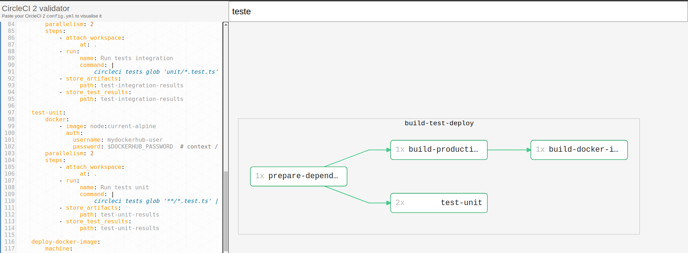
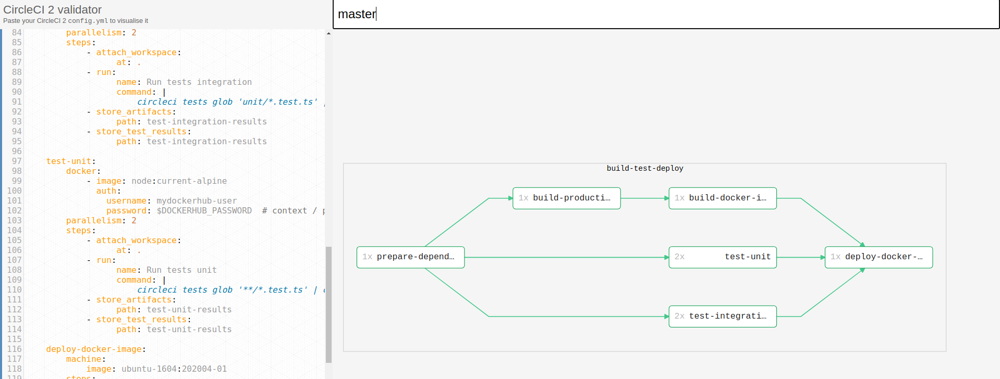

<p align="center">
  <a href="https://github.com/pagarme/cafe-com-testes">
    
  </a>
</p>

# Validando e visualizando os Fluxos de Trabalho do Circle CI

O [CircleCI](https://circleci.com/) tem limitações na validação do seu arquivo de configuração não contemplando o workflow criado. Sendo assim, em várias ocasiões nos deparamos com algumas dificuldades sendo uma delas o controle dos fluxos de trabalho. A ideia desse artigo é que você possa visualizar de forma gráfica o fluxo de trabalho, e possa visualizar ele em diferentes branches para ajudar naqueles casos mais complexos em que as rotinas e fluxos variam de acordo com a branch em execução.

Para isso existe um projeto que irei compartilhar com vocês, que nasceu com a proposta de nos ajudar nisso. Se você estiver lutando para gerenciar uma configuração complexa do Circle CI 2, você vai gostar de conhecer esse recurso.

O [Circleci Workflow Validator](https://github.com/JackuB/circleci-workflow-validator) te entrega a possibilidade de pegar o seu arquivo yml, fazer uma leitura dele e gerar pra você em tempo real o fluxo gráfico, sem que seja necessário você subir para o Circle CI, e em alguns casos descobrir que faltava algum detalhe ou que tinha algo errado no fluxo.

Para melhor entendimento, vamos levar para um cenário prático. Dado que temos a configuração a seguir e queremos validar o fluxo de trabalho dela:

```yml
version: 2.1

orbs:
    docker: circleci/docker@1.0.1

jobs:
    prepare-dependencies:
        docker:
            - image: node:current-alpine
              auth:
                username: mydockerhub-user
                password: $DOCKERHUB_PASSWORD  # context / project UI env-var reference
        steps:
            - checkout
            - run:
                  name: Compute version number
                  command: echo "0.0.${CIRCLE_BUILD_NUM}-${CIRCLE_SHA1:0:7}" | tee version.txt
            - restore_cache:
                  keys:
                      - yarn-deps-{{ checksum "yarn.lock" }}
                      - yarn-deps
            - run:
                  name: yarn install
                  command: yarn install
            - save_cache:
                  paths:
                      - node_modules
                  key: yarn-deps-{{ checksum "yarn.lock" }}-{{ epoch }}
            - store_artifacts:
                  path: yarn.lock
            - persist_to_workspace:
                  root: .
                  paths:
                      - .

    build-production:
        docker:
            - image: node:current-alpine
              auth:
                username: mydockerhub-user
                password: $DOCKERHUB_PASSWORD  # context / project UI env-var reference
        steps:
            - attach_workspace:
                  at: .
            - run:
                  name: Production build
                  command: |
                      export __BUILD_VERSION="$(cat version.txt)"
                      yarn build
            - store_artifacts:
                  path: dist/server.js
            - persist_to_workspace:
                  root: .
                  paths:
                      - .     

    build-docker-image:
        machine:
            image: ubuntu-1604:202004-01
        steps:
            - attach_workspace:
                  at: .
            - run:
                  name: Setup __BUILD_VERSION envvar
                  command: |
                      echo "export __BUILD_VERSION=\"$(cat version.txt)\"" >> $BASH_ENV
            - docker/check:
                  registry: $DOCKER_REGISTRY
            - docker/build:
                  image: $DOCKER_IMAGE_NAME
                  tag: $__BUILD_VERSION
                  registry: $DOCKER_REGISTRY
            - docker/push:
                  image: $DOCKER_IMAGE_NAME
                  tag: $__BUILD_VERSION
                  registry: $DOCKER_REGISTRY
                  
    test-integration:
        docker:
            - image: node:current-alpine
              auth:
                username: mydockerhub-user
                password: $DOCKERHUB_PASSWORD  # context / project UI env-var reference
        parallelism: 2
        steps:
            - attach_workspace:
                  at: .
            - run:
                  name: Run tests integration
                  command: |
                      circleci tests glob 'unit/*.test.ts' | circleci tests split --split-by timings | xargs yarn test:ci
            - store_artifacts:
                  path: test-integration-results
            - store_test_results:
                  path: test-integration-results

    test-unit:
        docker:
            - image: node:current-alpine
              auth:
                username: mydockerhub-user
                password: $DOCKERHUB_PASSWORD  # context / project UI env-var reference
        parallelism: 2
        steps:
            - attach_workspace:
                  at: .
            - run:
                  name: Run tests unit
                  command: |
                      circleci tests glob '**/*.test.ts' | circleci tests split --split-by timings | xargs yarn test:ci
            - store_artifacts:
                  path: test-unit-results
            - store_test_results:
                  path: test-unit-results

    deploy-docker-image:
        machine:
            image: ubuntu-1604:202004-01
        steps:
            - attach_workspace:
                  at: .
            - run:
                  name: Setup __BUILD_VERSION envvar
                  command: |
                      echo "export __BUILD_VERSION=\"$(cat version.txt)\"" >> $BASH_ENV
            - docker/check:
                  registry: $DOCKER_REGISTRY
            - docker/pull:
                  images: $DOCKER_REGISTRY/$DOCKER_IMAGE_NAME:$__BUILD_VERSION
            - run:
                  name: Tag the image as latest
                  command: docker tag $DOCKER_REGISTRY/$DOCKER_IMAGE_NAME:$__BUILD_VERSION $DOCKER_REGISTRY/$DOCKER_IMAGE_NAME:latest
            - docker/push:
                  image: $DOCKER_IMAGE_NAME
                  tag: latest
                  registry: $DOCKER_REGISTRY
              

workflows:
    version: 2
    build-test-deploy:
        jobs:
            - prepare-dependencies
            - build-production:
                  requires:
                      - prepare-dependencies
            - build-docker-image:
                  context: docker-hub
                  requires:
                      - build-production
            - test-integration:
                  requires:
                      - prepare-dependencies
                  		filters:
                        	branches:
                            	only:
                                	- master
            - test-unit:
                  requires:
                      - prepare-dependencies
            - deploy-docker-image:
                  context: docker-hub
                  requires:
                      - build-docker-image
                      - test-unit
                      - test-integration
                 
```

Seguiremos os seguintes passos para validarmos se o fluxo está atendendo o que precisamos/esperamos:

1. Iremos acessar o site do validador clicando no [link](https://circle.mikul.as/)
2. Pegaremos o código que queremos validar e colaremos ele no campo da esquerda
3. Uma vez feito isso ele irá gerar a visualização do workflow 

Mágico né? Mas tem outra coisa muito legal ainda. Se observar no nosso arquivo yml de exemplo o job `test-integration` roda somente quando está na branch `master`, e para ver isso acontecendo basta que na parte superior do site você coloque a branch `master` e verá esse job no workflow. E caso queira ver o caso em que não é a branch `master` bastará inserir outro nome de branch, como branch `teste` , por exemplo. Então, você visualizará como ficará esse fluxo, isso dará a visibilidade que precisa do fluxo com o filtro e sem o filtro, assim como outros aspectos que sabemos que existem muitos no _Circle CI_.

Veja nas imagens:

Simulando o workflow da branch `teste`:

<p align="left">
  <a href="https://github.com/pagarme/cafe-com-testes">
    
  </a>
</p>

Simulando o workflow com a branch `master`:

<p align="left">
  <a href="https://github.com/pagarme/cafe-com-testes">
    
  </a>
</p>

E aí? Gostou desse recurso? Então compartilha com a galera que pode estar sofrendo por aí, e experimente nos seus projetos. Essa é uma ótima oportunidade de validar seus fluxos antes de subir as alterações. Ah, e se quer validar se o seu arquivo yml está certinho, nós também temos um artigo que te ajudamos com isso, corre lá clica [aqui.](circleci-validate.md)
