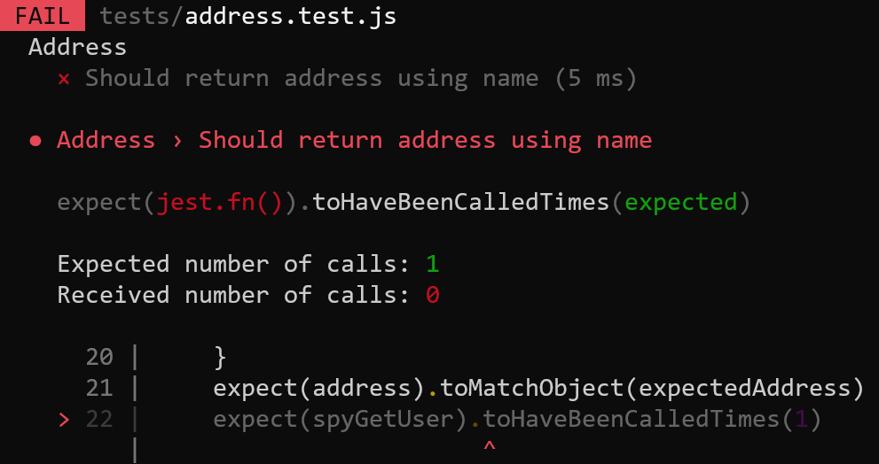

<p align="center">
  <a href="https://github.com/pagarme/cafe-com-testes">
    
  </a>
</p>

# Teste o comportamento, não a implementação

### Falsos negativos

Ao testar como uma classe/função foi implementada estamos tornando o nosso código resistente contra refatoração, pois este estará suscetível a falsos negativos. Falsos negativos reduzem a confiança do time nos testes automatizados.

Além disso, uma refatoração deve ter os testes automatizados como apoio para garantir que o comportamento foi mantido. Se os testes começarem a falhar não será possível validar de forma rápida se a alteração foi bem sucedida.

### Manutenção mais custosa

Os testes que são dependentes dos detalhes de implementação são mais difíceis de manter, pois precisam ser alterados a cada refatoração.

> É preciso atentar com a quantidade de dublês de testes (mocks, stubs, etc) dos seus testes unitários.
>
> Uma grande quantidade de dublês em cada teste pode ser um indicativo de que a implementação está sendo testada e isso resultará em problemas para o time conforme o tempo passa e o sistema evolui.

## Exemplo

Possuímos uma função (`getAddressByName`) que retorna o endereço de um usuário a partir de seu nome completo:

```javascript
// src.js
function getAddressByName(fullname) {
  const user = await getUser({ name: fullname })
  const address = await getAddressByUserId(user.id)
  return address
}
```

Possuímos um teste para o método acima. Além de validarmos o endereço retornado (**comportamento**), é validado se o método `getUser` foi chamado 1 vez e qual parâmetro foi passado (**implementação**):

```javascript
test('Should return address using name', () => {
  const spyGetUser = jest.spyOn(src, 'getUser')

  const address = address.getAddressByName('Aaron Elbakyan')

  const expectedAddress = {
    numero: '230',
    cidade: 'Belo Horizonte'
  }
  expect(address).toMatchObject(expectedAddress) // testando comportamento
  expect(spyGetUser).toHaveBeenCalledTimes(1) // testando implementação
  expect(spyGetUser).toHaveBeenCalledWith({ name: 'Aaron Elbakyan' }) // testando implementação
```

Se rodarmos o teste, ele passa com sucesso :partying_face: :sparkles:

<p align="left">
  <a href="https://github.com/pagarme/cafe-com-testes">
    
  </a>
</p>

### Refatoração

Porém houve alteração nos domínios de negócio de cada time e foi decidido que a busca de usuários deve ir para outro time. Então ao invés de chamarmos um método interno (`getUser`), a busca passa a ser feita através da API do outro time:

```javascript
function getAddressByName(fullname) {
  const { data } = await axios.get(`https://empresa.com/usuarios?name=${fullname}`)
  const address = await getAddressByUserId(data.userId)
  return address
}
```

Ao executar o nosso teste novamente ele começa a falhar, independente do endereço retornado pelo método ser o mesmo. Isso é um **falso negativo**.

<p align="left">
  <a href="https://github.com/pagarme/cafe-com-testes">
    
  </a>
</p>

---

### Testando comportamento

Se o teste fosse como o abaixo, validando apenas o comportamento, a refatoração não teria resultado em falha:

```javascript
test('Should return address using name', () => {
  const address = address.getAddressByName('Aaron Elbakyan')

  const expectedAddress = {
    numero: '230',
    cidade: 'Belo Horizonte'
  }
  expect(address).toMatchObject(expectedAddress)
```
